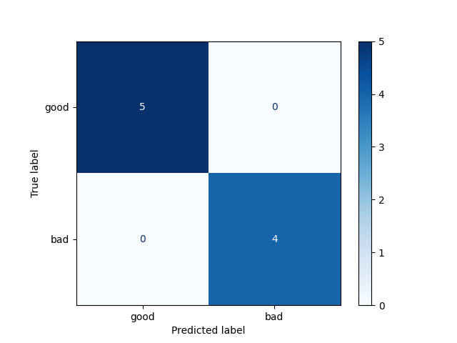
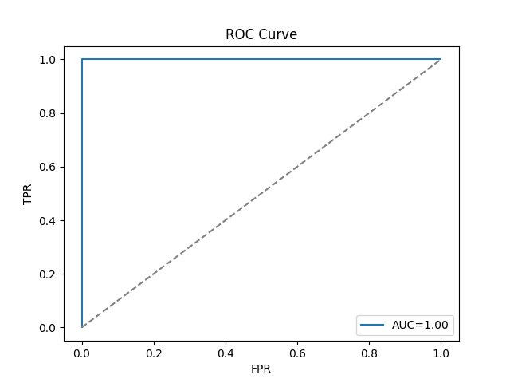
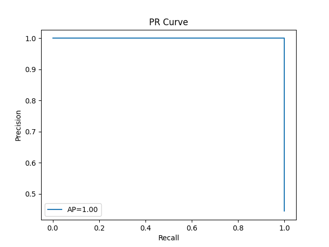
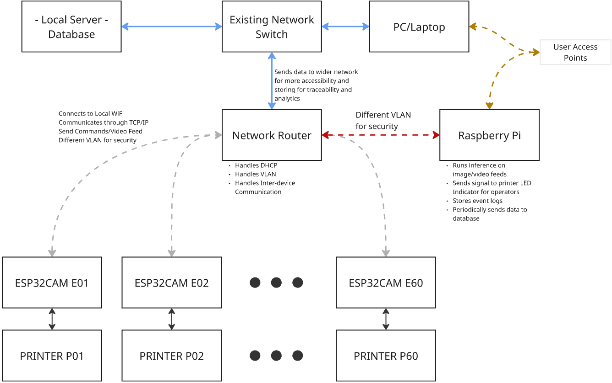

# 3D Printing Farm Automation MVP

This project is an **AI-driven system for monitoring a 3D printing farm** (60 printers).  
It simulates print progress, manages spool inventory, detects failures using AI,  
and provides a Streamlit dashboard for operators.

---

## Features

- **AI-Powered Failure Detection**
  - MobileNetV2 model fine-tuned on 3D print images (42 `good` vs 42 `bad`).
  - Real-time inference on simulated camera feed.
  - Configurable threshold (default: 0.35) for triggering failure.

- **Real-Time Inventory & Progress Tracking**
  - Tracks spool consumption at 5 g/s.
  - Low spool warnings when remaining material < 150 g.
  - Fails automatically when spool runs out.

- **Streamlit Dashboard**
  - **Printers**: Live status (progress, spool, AI camera feed).
  - **Start Job**: Start new jobs (with force/attended modes).
  - **Actions**: Simulate failure, stop, or reset printers.
  - **Events**: View append-only event logs.

- **Training & Inference**
  - Training pipeline with data augmentation, class balancing, early stopping.
  - Inference script for single-image classification via CLI.
  - YAML-based configuration.

---

## Installation

1. Clone the repository:
   ```bash
   git clone https://github.com/JasonV33/3D-Printing-Farm-Automation-MVP
   cd project-root
   ```

2. Create a virtual environment:
   ```bash
   python -m venv .venv
   source .venv/bin/activate    # Linux / Mac
   .venv\Scripts\activate       # Windows
   ```

3. Install dependencies:
   ```bash
   pip install -r requirements.txt
   ```

---

## Usage

### 1. Run the Dashboard
```bash
streamlit run interface_ui.py
```
- Simulates 60 printers with live status, spool tracking, and AI camera feed.

### 2. Train the AI Model
```bash
python training/train.py
```
- Uses dataset defined in `training/config_training.yaml`.
- Outputs logs, metrics, and model to `outputs/`.

### 3. Run Inference
```bash
python inference/inference_failure_model.py \
    --image data/images/sample_bad.jpg \
    --weights outputs/best_model.pth \
    --threshold 0.35
```

---

## Configuration

The file `training/config_training.yaml` controls:
- Dataset paths (images + COCO annotations).
- Train/val/test split ratios.
- Training hyperparameters (epochs, batch size, learning rate).
- Threshold for classifying bad prints.
- Output directories for logs and models.

---

## Outputs

**Confusion Matrix**



**ROC Curve**



**Precision-Recall Curve**



---

## Local, Offline Implementation (Bonus Discussion)

In a production environment, running this system entirely online would introduce unnecessary risks and costs.  
To make it more resilient and scalable, a **local network architecture** can be used where all printers, ESP32CAM modules, the Raspberry Pi controller, and the database operate within the same local network independent of a constant internet connection.



Instead of placing a **Raspberry Pi on every printer**, which would be expensive and hard to maintain, this architecture uses one central Raspberry Pis connected to the **network router**. The ESP32CAM modules on each printer connect to the router over Wi-Fi, sending video snapshots and status updates through **TCP/IP or MQTT over TCP**.

The router provides:
- **DHCP**: assigning IP addresses to all devices  
- **VLAN segmentation**: separating IoT devices, servers, and admin clients into secure zones  
- **Inter-VLAN routing rules**: controlling which devices can access the database or dashboard  

The Raspberry Pi, placed in its own VLAN, runs the AI inference engine, manages printer indicators for operators, stores event logs, and periodically pushes data into the local database. A dedicated local server stores long-term data for analytics, and operator laptops connect through separate access points with controlled access.

### Benefits
- **Cost-effective** -> avoids needing 60+ Raspberry Pis (one per printer)  
- **Scalable** -> the router/AP can support many printers as the farm grows  
- **Secure** -> VLANs isolate IoT devices from servers and admin clients  
- **Future-proof** -> integrates into wider LAN or corporate networks for traceability  
- **Support** -> easier to update and maintain a few central devices than dozens of distributed ones  

While more complex than a one Pi per printer setup, this architecture is **more scalable, secure, and cost-effective for the long run**.

---

## Author

Developed by **Jason Menard Vasallo** for the Ocean Builders AI Software Engineer Evaluation.
